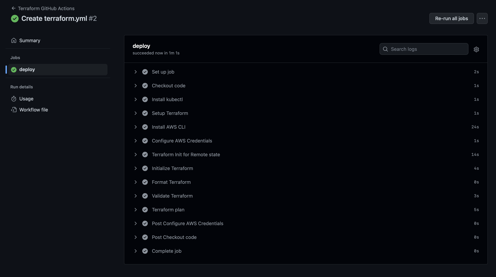

# **IaaC EXAMINATION DEPLOYMENT**
## __TERRAFORM & KUBERNETES FULLY AUTOMATED PROJECT__
 

## **1. Cloud Provider: AWS EKS**
## **2. Automation Tool: Terraform and Kubernetes**
## **3. Deployment Tool: Terraform and Kubernetes**
## **4. Monitoring Tool: Prometheus and Grafana**
## **5. Logging Tool: Prometheus**
## **6. Metrics Tool: Prometheus, Grafana and Kube-State**
## **7. CICD Pipeline: GitHub Actions**
 

## **Summary:**
 

<li> Kubernetes Cluster (EKS) - The K8 cluster and node group was created with terraform on AWS EKS. It was fully automated with the creations being the vpc, security group, IAM policy, eks cluster and other resources needs. See the available namespaces below
 

 

 
<li> Sock-Shop Application - The Sock-Shop Manifest folder was used for this. The "kubectl_manifest" resource on terraform was used for deployment into the cluster node and the frontend was exposed using a load balancer.
 

 

 
<li> Web-Application - This is my demo portfolio web page that was pushed into docker hub with nginx. The service file was exposed to the web with a load balancer.
 

 

 
<li> Monitoring, Logging & Mertics - All these go hand in hand with Prometheus, Grafana and Kube-State. They were all deployed using their mainfest file with terraform and the annonation for prometheus scrape was also added to the service yaml of my portfolio web application.
 

 

 
<li> CICD Pipeline - GitHub Actions was used for the fully deployment and automation. The entire deployment use case can be ran from top to buttom using terraform. A workflow file is created to run the deployment with GitHub Action. See the actions places in the current repo.
 

 

 

# **DISCLAIMER!!**

## **"terraform apply" and "terraform destroy" were not added to the workflow document because this is for a project work and not actually deployment or production environment, and also because of the high cost of using AWS. Since the application is already running. It is from installation till "terraform plan"..**
